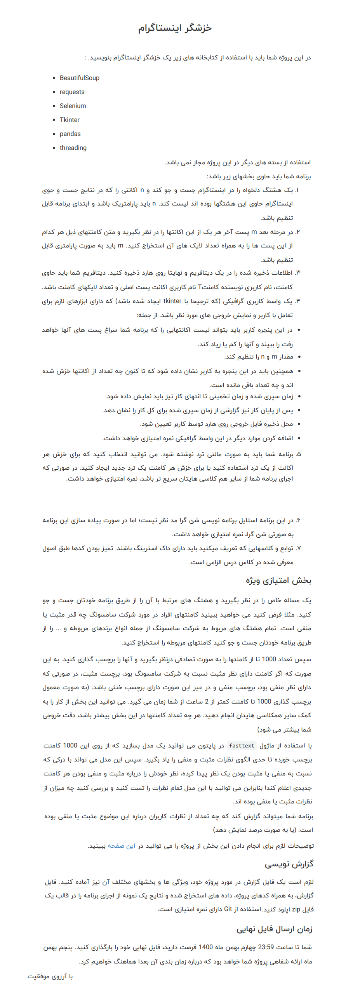

# **🕷 Instagram Web Crawler Project | پروژه خزشگر وب اینستاگرام**

A university project in which a web crawler is designed for the Instagram website and fasttext is used to predict the positive or negative content of a post's comments.

یک پروژه دانشگاهی که در آن یک خزشگر وب برای وبسایت اینستاگرام طراحی می‌شود و از fasttext برای پیش‌بینی محتوای مثبت یا منفی کامنت‌های یک پست استفاده می‌شود.

# 💬 **نکات پروژه**

* عکس‌های برنامه در دایرکتوری ScreenShots قرار دارند.
* برای اجرا برنامه، به پایتون بالاتر از نسخه 3.6 نیاز دارید.
* کتابخانه‌های مورد نیاز در فایل requirements.txt قرار دارند.
* برای استفاده از برنامه، نیاز هست که نسخه‌ی مناسب chromedriver.exe را با توجه به نسخه‌ی Chrome Browser خود دانلود کرده و در کنار برنامه قرار دهید.
* برای دسترسی به همه‌ی پروژه‌های دانشگاهی من، به این لینک مراجعه کنید:

👈🏻 **[پروژه‌های دانشگاهی من](https://github.com/bestmahdi2/Uni__Bachelors_SKU_Path)**

# 📝 **توضیحات پروژه**

# 🖼 **عکس‌های پروژه**

  
  
  
  
  

